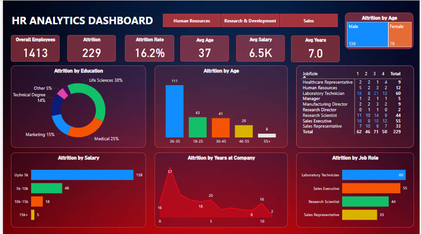

# HR-Analytics-Dashboard-using-Power-Bi

The HR Analytics Dashboard is a Power BI project designed to help HR teams analyze employee attrition trends and workforce insights. The dashboard provides detailed findings on attrition rates based on various factors, enabling data-driven decision-making which helps an organisation to improve the employee retention (reduce attrition).

🔍 **Features**

Total Employee Count: Displays the total number of employees in the company.

Attrition Analysis:
- Number of attrition employees.
- Overall attrition rate.
- Attrition rate by age group.
- Attrition rate by salary range.
- Attrition rate by years worked at the company.
- Attrition rate by gender.
- Attrition rate by job role.

📊 **Dashboard Preview**

🛠️ **Tools & Technologies**

Power BI: Data visualization and dashboard development
Excel / CSV: Data source
DAX (Data Analysis Expressions): Used for custom calculations and measures

📊 **Data Source**

The dataset contains information such as:

Employee ID, Age, Gender, Department
Job Role, Experience Level, Salary
Performance Ratings, Attrition Status
Joining Date, Exit Date, and Reasons for Leaving

⚙️ **Implementation Steps**

Data Collection: Import HR data from CSV/Excel or SQL database.
Data Cleaning & Transformation: Handle missing values, normalize data formats, and create calculated columns using Power Query.
Dashboard Creation:
- Build interactive visuals such as bar charts, pie charts, and KPI cards.
- Use DAX formulas to create custom measures (e.g., attrition rate by different factors).
- Implement slicers for dynamic filtering by department, gender, and job roles.
- Insights & Interpretation: Analyze attrition trends and key workforce metrics

📈 **Key Metrics Tracked**

- Total Employees
- Number of Attrition Employees
- Overall Attrition Rate
- Attrition Rate by Age
- Attrition Rate by Salary
- Attrition Rate by Years Worked at Company
- Attrition Rate by Gender
- Attrition Rate by Job Role

🚀 **Conclusion**

This HR Analytics Dashboard empowers HR professionals with data-driven insights to understand employee attrition patterns. It provides an interactive visualization of key HR metrics, helping businesses strategize workforce retention and employee satisfaction initiatives.
